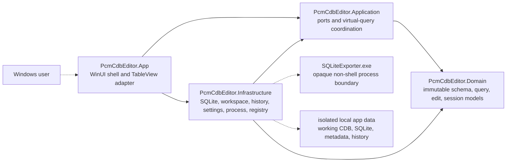

# Architecture

PCM CDB Editor separates product models and orchestration from its Windows, SQLite, filesystem, process, registry, and UI integrations. Four projects enforce those boundaries.

Solid arrows between projects show compile-time dependencies. `PcmCdbEditor.App` references Infrastructure to construct Application port implementations at startup; product behavior otherwise crosses Application contracts. Dotted arrows show user or runtime interactions. `WinUI.TableView` types remain inside `TableGridAdapterControl`.

## Project responsibilities

### Domain

`PcmCdbEditor.Domain` defines immutable SQLite storage values, row identities and revisions, runtime schema metadata, page/filter/sort requests, row-count state, view preferences, lifecycle models, reversible edit operations, replay guards, and maintenance previews. It has no WinUI, SQLite-package, process, registry, or filesystem dependency.

### Application

`PcmCdbEditor.Application` owns ports for conversion, workspaces, schema discovery, table data, edit history and replay, settings, file association, the grid adapter, and maintenance. It also owns:

- identifier validation against the current schema catalog;
- the numbered `AND`/`OR` advanced-filter parser;
- stable query models;
- operation gates that prevent conflicting work and suppress stale asynchronous completions;
- an inline-edit commit stager that separates pre-commit parsing from post-lifecycle mutation, plus the shared rider-ID parser; and
- bounded virtual-query coordination with independently cancellable row and count work.

No package-specific UI event or SQLite connection type crosses these contracts.

### Infrastructure

`PcmCdbEditor.Infrastructure` implements the edge ports:

- non-shell exporter execution with literal argument lists, bounded sanitized diagnostics, cancellation, timeout, and process-tree termination;
- copy-first sessions, staged import, backup-before-replacement for existing non-empty destinations, guarded fallback, and recovery enumeration;
- runtime table/view/column/key/FK discovery, conservative relationship inference, signatures, and safe edit-capability classification;
- an internal SQLite operation runner that moves UI-reachable catalog, query/count, edit/replay, workspace validation, and maintenance work off the WinUI dispatcher;
- native cancellation through `sqlite3_interrupt`, with the interrupt registration disposed before its connection and a canceled `SQLITE_INTERRUPT` translated to `OperationCanceledException`;
- bounded parameterized queries, counts, and searches, plus transactional typed insert, update, and delete operations;
- batched foreign-key display resolution and stable database-side sorting;
- atomic settings and schema-signature-keyed view state;
- disk-backed session history and guarded replay for updates, inserts, deletes, and maintenance commands; and
- per-user Windows file association plus the schema-gated maintenance workflows and the clean, atomic rider/contract creation service.

History snapshots live inside the active session because undoing deletes and maintenance requires complete typed rows. Settings and view state do not contain database row values, but recent-file settings can contain local filesystem paths.

### App

`PcmCdbEditor.App` provides the high-density WinUI 3 shell, responsive navigation, command/status surfaces, multiple table tabs, row inspector, recovery and confirmation dialogs, settings, and maintenance previews. It composes:

- copy-first picker, command-line, recent-file, and association activation;
- target-named table loading in which only the current request may bind rows, change status, or dismiss the loading surface;
- cancellation that restores the previous completed tab and focus, plus lazy per-tab counts that update count text without rebinding rows;
- bounded virtual browsing and lazy counts;
- raw, resolved-name, and `raw | name` FK display modes;
- typed inline edits that preserve the existing SQLite storage class;
- a full-row editor with explicit Integer, Real, Text, and NULL choices while treating BLOBs as read-only metadata;
- rider recovery by explicit ID list or lazily loaded team roster, with selected rows available through an explicit copy action;
- a dedicated six-step Create Rider destination with live game-name generation, bounded name/ID lookups, ordered favorite races, the complete ability matrix and potential, typed Advanced controls, and complete insert review;
- disk-backed undo/redo with saved-baseline tracking; and
- theme, density, page size, recent files, view state, and file-association controls.

Inline commits use the row identity and revision captured with the visible page, then pass through the same transactional edit, dirty-state, history, refresh, and error path as row-inspector edits. `CellEditEnding` only validates and stages an immutable update. `CellEditEnded` publishes it exactly once after a successful commit; cancellation, validation failure, rebinding, or a changed bind generation clears the pending update. The TableView adapter prepares a completed page before replacing its source and reuses compatible columns, current column, multi-selection, and viewport state.

Create Rider keeps wizard state and typed controls in the App, immutable draft/input/preview models in Domain, its port in Application, and schema discovery, clean-default resolution, lookup search, preview, and insertion in Infrastructure. The draft is scoped to one database session. `gene_sz_firstlastname`, `value_f_potentiel`, and `gene_ilist_fkIDfavorite_races` are controlled workflow fields rather than generic Advanced overrides. Preview allocates checked `MAX + 1` identities, builds every insert value without a source rider, and fingerprints schema, save date, lookup rows and selected favorite-race revisions, maxima, target absence, defaults, overrides, role, abilities, potential, the ordered favorite list and serialized text, missing Limits, and complete inserts. Apply repeats those checks inside one deferred-foreign-key transaction, reads both rows back, and records contract then rider so Undo removes rider before contract and Redo restores both atomically. The Create command is recalculated after the preview operation releases its exclusive lease, so a current valid preview becomes actionable once the app returns to Ready.

## Runtime data boundaries

- **Original CDB:** user-owned input; validated and copied, never passed directly to the exporter.
- **Session:** `%LOCALAPPDATA%\PcmCdbEditor\Sessions\<session-id>`; copied CDB, working SQLite, lifecycle metadata, and edit history.
- **Backup:** `%LOCALAPPDATA%\PcmCdbEditor\Backups`; retained separately from session cleanup.
- **Settings:** theme, density, page size, FK mode, recent CDB paths, and schema-keyed table layout; no database row values.
- **Converter:** the bundled `SQLiteExporter.exe`; an opaque third-party process that receives only session copies and staged output paths.
- **Release payload:** one staged self-contained `win-x64` directory intended to be used unchanged for ZIP and installer input.

Lifecycle guarantees are documented in [Safety and recovery](safety-and-recovery.md). Packaging boundaries are documented in [Release and verification](release-and-verification.md).
