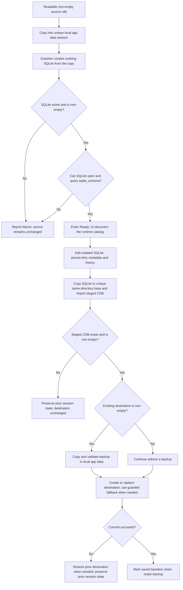

# Safety and recovery

PCM CDB Editor's central invariant is that SQLiteExporter never receives the user's original CDB. Editing occurs in an isolated session. Save requires a staged CDB to exist and be non-empty, and it backs up an existing non-empty destination before replacement.



The diagram describes the implemented `WorkspaceService` and `CdbConverter` lifecycle. The staged-output check establishes only that the expected CDB exists and is non-empty; it does not parse or reopen the staged CDB before commit.

## Open rules

1. Accept only an existing, readable, non-empty `.cdb` file.
2. Create `%LOCALAPPDATA%\PcmCdbEditor\Sessions\<session-id>`.
3. Copy the source into the session as the working CDB.
4. Invoke `SQLiteExporter.exe -a -export <working-copy>` with `ProcessStartInfo.ArgumentList`, never a shell or concatenated command string.
5. Require the resulting SQLite file to exist and be non-empty.
6. Open the SQLite file read-only and require `SELECT COUNT(*) FROM sqlite_schema` to succeed.
7. Enter Ready, after which the UI discovers the runtime catalog and attaches disk-backed edit history to the activated session.

Failure or cancellation leaves the original unchanged. Invalid newly created temporary state is cleaned best effort; a valid dirty session is never silently deleted.

## Save and Save as rules

The import boundary is:

```text
SQLiteExporter.exe -a -import <temporary-output-base>
```

Before invocation, the working SQLite database is copied to `<temporary-output-base>.sqlite`. The base is unique and in the destination directory so final replacement does not cross volumes.

If the destination exists and is non-empty, it is copied to `%LOCALAPPDATA%\PcmCdbEditor\Backups` and the backup is checked for non-empty content before replacement. A missing destination or a zero-byte placeholder is committed without a backup. `File.Replace` is preferred when a destination exists. The guarded fallback moves the previous destination aside, installs the staged file, and restores the previous file if installation fails.

Open/export/stage work remains cancellable. Once final replacement starts, cancellation is deliberately ignored until that short commit boundary completes. A failed save preserves the session's prior dirty state. A successful commit advances the persisted saved baseline and clears dirty state when present. A metadata/history-baseline failure after a successful commit is surfaced explicitly rather than pretending the session is fully synchronized.

## Converter containment

- Default and maximum timeout: ten minutes.
- Standard output and error are drained concurrently and capped at 16,384 UTF-16 code units each.
- Known file paths are redacted and control characters are sanitized before diagnostics cross the process boundary.
- Active cancellation or timeout terminates the process tree.
- A zero exit code is insufficient; the expected output must exist and be non-empty.
- The exporter is opaque. Do not modify, decompile, invoke through a shell, or grant it the original CDB.

Integration tests cover missing or invalid inputs, start and exit failures, missing or empty output, diagnostic bounds and sanitization, literal arguments, cancellation, timeout, and child-process termination.

## Recovery and history

Session metadata identifies the source and save paths, working files, lifecycle, dirty state, timestamps, and last backup without embedding row contents. Startup offers **Resume**, **Discard**, or **Not now** only for sessions whose metadata marks them dirty and whose working CDB and SQLite files still validate.

Disk-backed history is stored inside the session and can contain complete typed row snapshots required to undo deletes and maintenance, including BLOB bytes encoded in the history document. It is written atomically, bounded to the session, and uses row presence and revision guards during replay. Redo is cleared by a new edit. Save and Save as record a baseline; edits can remain undoable after save while the baseline distinguishes saved from unsaved state.

Settings are stored separately. They do not contain database row values, but they can contain schema and table names plus up to twelve recent CDB filesystem paths. Treat settings, sessions, history, and backups as sensitive user data. Do not attach them to issues, commit them, or copy their contents into logs.

Recovery after abnormal termination is best effort, not general crash repair. Incomplete or unreadable metadata, a missing or empty working CDB, or an invalid working SQLite file prevents a session from being offered at startup. Retain an independent backup of valuable data.

## SQLite cancellation

Catalog, page/count, edit/replay, workspace-validation, and maintenance SQLite operations run through one internal worker boundary so synchronous native database work does not occupy the WinUI dispatcher. A cancellation request calls `sqlite3_interrupt` on the active connection. The registration is disposed before the connection, and an `SQLITE_INTERRUPT` becomes `OperationCanceledException` only when the caller's token was canceled.

Write paths attempt rollback without reusing the canceled token. SQLite may already have rolled back the transaction after an interrupt; the cleanup path preserves the original cancellation while accepting that native autocommit state. Synthetic long-read and long-write tests verify interruption, rollback safety, and successful use of the database afterward.

## Close, uninstall, and cleanup

Closing a table tab retains database edits and does not prompt. Replacing the open database or closing the app prompts when doing so could discard dirty work.

The app removes a session after an ordinary clean close or an explicitly confirmed discard. Startup also removes session directories already marked closed or cancelled. It does not automatically expire or delete backups.

The installer is configured per user under `%LOCALAPPDATA%\Programs\PcmCdbEditor`. Settings, sessions, and backups live under `%LOCALAPPDATA%\PcmCdbEditor`, outside installed application files. Ordinary uninstall removes the application and file-association registration but intentionally preserves that user data; reinstalling or uninstalling is not a cleanup mechanism.

## User precautions

Use only data you are authorized to modify. Retain an independent backup, inspect the reported destination/backup outcome after saving, and do not rely on a prerelease session as the only copy of valuable data.
